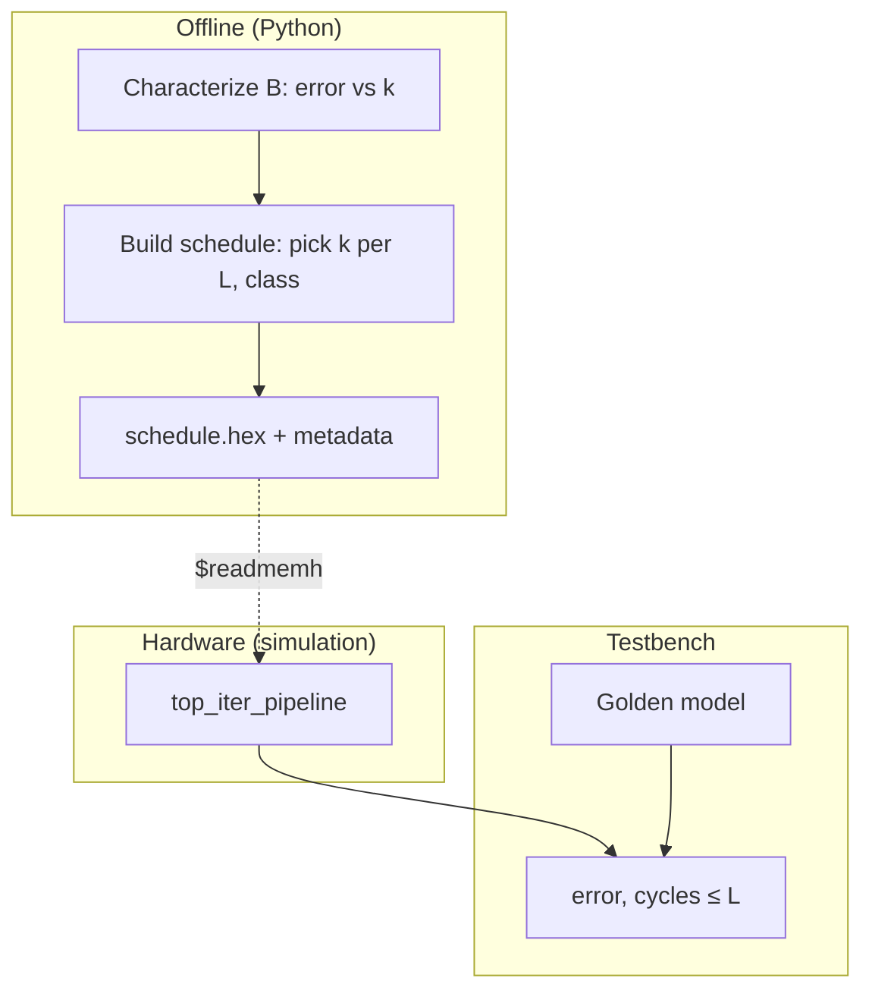
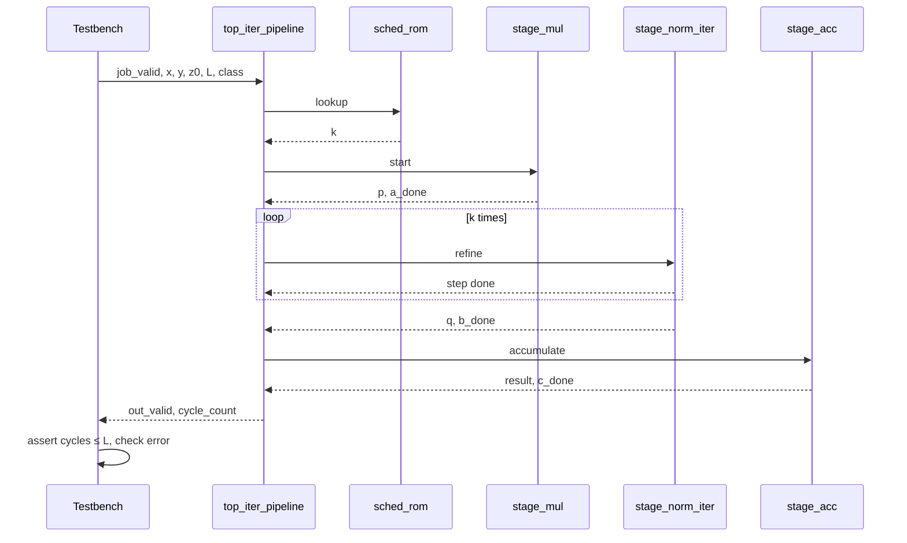
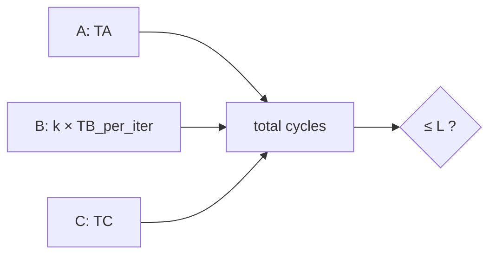
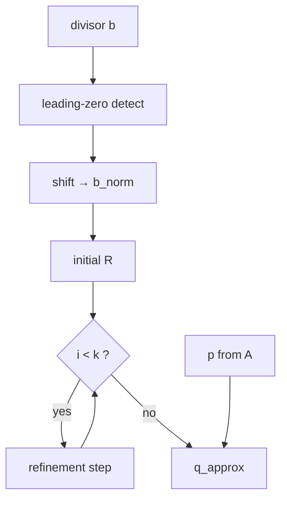
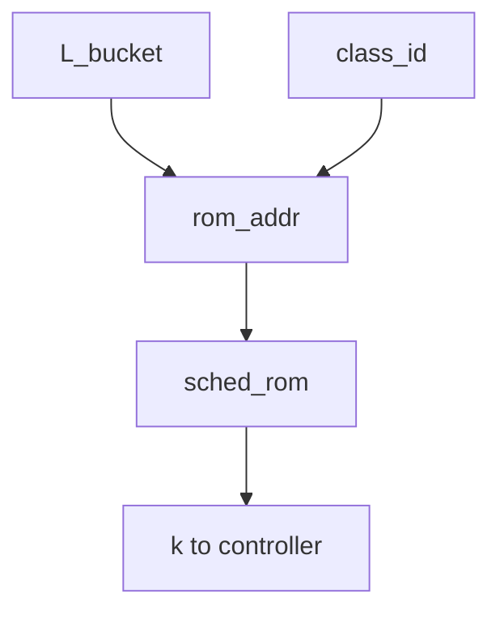
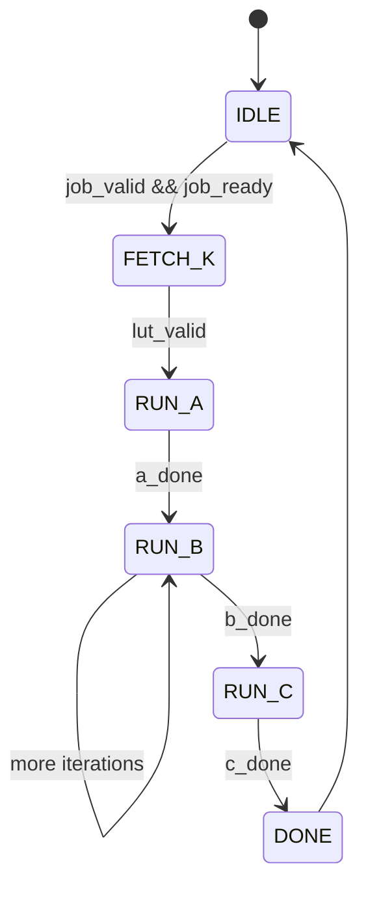
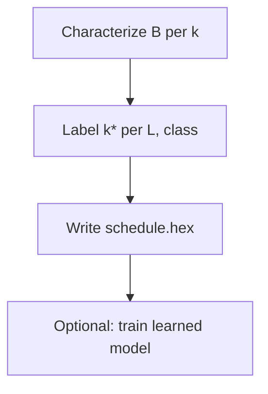

# Latency-bounded iterative approximate pipeline — step-by-step walkthrough

**Purpose:** A single document you can read top-to-bottom to understand **what** this project is, **what every term means**, **how the pieces connect**, and **how to implement each block** (broken into smaller sub-blocks). Diagrams are included here; additional figures live in [`iterative_approximate_dag_diagram.md`](iterative_approximate_dag_diagram.md).

**Repository:** `Latency-Bounded-Scheduling-For-Iterative-Approximate-Pipeline`

---

## Part 0 — The problem in one minute

Many embedded pipelines must finish a chain of operations before a **deadline** (a maximum number of clock cycles). One stage in the chain is **iterative**: it improves its answer by repeating a refinement step. More repetitions → **better accuracy** but **more cycles**.

**This project answers:**

> For each incoming job, how many refinement iterations **`k`** should we run so we **never exceed** cycle budget **`L`**, while keeping the **final numeric error** as small as possible?

**Approach:**

1. Build the pipeline in **RTL** (hardware description) and simulate it.
2. **Precompute** good values of **`k`** in software (exhaustive search → lookup table in ROM).
3. Optionally **train a small model** to predict **`k`** and prove it matches the precomputed table.
4. **Measure** error and deadline compliance vs simple baselines (always min-`k`, always max-`k`).

---

## Part 1 — Vocabulary (read before anything else)

| Term | Meaning in this project |
|------|-------------------------|
| **Job** | One end-to-end run: operands go in, one result comes out. |
| **Cycle** | One rising edge of the clock; the unit of time in simulation. |
| **Deadline `L`** | Maximum cycles allowed for this job (entire A→B→C path). |
| **`k`** | Number of **refinement iterations** in Station B only (e.g. 2, 4, or 6). |
| **`TA`, `TC`** | Fixed cycle costs of Station A and Station C (constants you measure from RTL). |
| **`TB_per_iter`** | Cycles consumed by **one** refinement step in Station B. |
| **Cycle budget** | `TA + k × TB_per_iter + TC` must be **≤ `L`**. |
| **RTL** | SystemVerilog/Verilog source that describes digital logic. |
| **Fixed-point** | Integers with an agreed binary point (e.g. Q1.15); no floating-point unit required. |
| **Golden model** | High-precision reference (Python/C) used to score hardware output. |
| **Scheduler / ROM** | Hardware that outputs **`k`** for this job based on **`L`** (and optional **class**). |
| **DAG** | Directed acyclic graph of dependencies; here simply **A → B → C** (a chain). |
| **CSR** | Control/status register; testbench or host sets **`L`**, reads **status**. |
| **Station A / B / C** | The three processing blocks in order. |
| **Learned schedule** | Small ML model that predicts **`k`**; validated against exhaustive optimal table. |

---

## Part 2 — Big picture (offline + hardware + test)

### 2.1 What happens before silicon or simulation config

Software studies the math and builds a **schedule table**: for each combination of (deadline bucket, input class), store the best **`k`**.

### 2.2 What happens in hardware each job

Hardware looks up **`k`**, runs A then B ( **`k`** times inner loop) then C, counts cycles, outputs result.

### 2.3 What the testbench checks

Compare result to golden model; assert **cycles ≤ L**; log CSV for plots.

### 2.4 System diagram



*Full diagram set: [`iterative_approximate_dag_diagram.md`](iterative_approximate_dag_diagram.md) §1–12.*

---

## Part 3 — The three stations (plain language)

Think of a **factory line** with three machines in a row:

| Station | Name | Fast or careful? | Output |
|---------|------|------------------|--------|
| **A** | Multiply | Always **fixed** work | `p = x × y` |
| **B** | Normalize / divide | **Dial `k`**: more iterations = more accurate | `q` ≈ normalized `p` |
| **C** | Accumulate | Always **fixed** work | `result = z0 + q` (or similar) |

**Order is strict:** B cannot start until A finishes; C cannot start until B finishes.

**The only quality knob in v1 is `k`** on Station B.

---

## Part 4 — One job, step by step (runtime narrative)

| Step | What happens |
|------|----------------|
| **1** | Testbench asserts `job_valid`; presents `x`, `y`, `z0`, `csr_deadline_L`, optional `segment_class_id`. |
| **2** | Controller maps `L` → `L_bucket`; scheduler ROM returns **`k`**. |
| **3** | Controller clears **job cycle counter**; enters **RUN_A**. |
| **4** | Station A computes **`p`**; signals **a_done** after `TA` cycles. |
| **5** | Station B runs refinement loop **`k` times**; signals **b_done**. |
| **6** | Station C computes **result**; signals **c_done** after `TC` cycles. |
| **7** | Controller asserts **out_valid**; exposes **cycle_count**. |
| **8** | Testbench checks **cycle_count ≤ L** and **|result − y_ref|**. |

### 4.1 Sequence diagram



---

## Part 5 — Cycle budget (the core constraint)

**Formula:**

```text
cycles_total = TA + k × TB_per_iter + TC
cycles_total ≤ L
```

**Example** (replace with your measured constants):

| Parameter | Value |
|-----------|------:|
| TA | 3 |
| TB_per_iter | 3 |
| TC | 3 |
| L | 20 |
| k max feasible | floor((20−3−3)/3) = **4** |

If ROM chooses **`k = 6`** but only 4 fit in **`L`**, that row is **invalid** — offline tool must only emit feasible pairs.



---

## Part 6 — Implementation map (every block → sub-blocks)

Below is the **recommended build order**. Each top-level block lists **sub-blocks**, **interfaces**, and **done criteria**.

---

### 6.1 Block: `stage_mul` (Station A)

**Role:** `p = x * y` in fixed-point.

| Sub-block | What to implement | Done when |
|-----------|-------------------|-----------|
| **A.1** | Parameter `W` (width), define Q format (e.g. Q1.15) | Format documented in README |
| **A.2** | Combinational or pipelined multiplier | Matches golden on 1k random pairs |
| **A.3** | `start` / `done` handshake | FSM can wait on **a_done** |
| **A.4** | Overflow / saturation policy | Documented; tests for max inputs |

**Inputs:** `clk`, `rst_n`, `x[W-1:0]`, `y[W-1:0]`, `start`  
**Outputs:** `p[W-1:0]`, `done`  
**Latency:** **`TA`** cycles (measure with `$time` or cycle counter in TB)

---

### 6.2 Block: `stage_norm_iter` (Station B) — **critical path**

**Role:** Iterative divide/normalize; run exactly **`k`** refinement steps unless you add early-stop later.

#### 6.2.1 Sub-blocks inside Station B

| Sub-block | What to implement | Done when |
|-----------|-------------------|-----------|
| **B.1 Normalize divisor** | Leading-zero detect + shift → `b_norm` in [0.5, 1) | Matches Python on test vectors |
| **B.2 Initial guess** | Seed `R` (linear approx or table) | Monotonic improvement vs k in sim |
| **B.3 Refinement step** | One NR or Taylor update: `R ← f(R, b_norm)` | One step matches golden step |
| **B.4 Iteration counter** | `i` from 0 to `k−1`; `k` from port | Stops after exactly `k` steps |
| **B.5 Finalize** | `q ≈ p_norm × R` (+ exponent adjust if used) | End-to-end error vs k plot |
| **B.6 Handshake** | `start`, `k`, `done` | Top FSM integrates |

#### 6.2.2 Station B internal diagram



**Inputs:** `p`, divisor or implicit scale, `k`, `start`  
**Outputs:** `q`, `done`  
**Latency:** **`k × TB_per_iter + overhead`**

**Implementation note:** Build **B.3** and **B.4** first in isolation with **`k`** wired from TB; only then connect to A and C.

---

### 6.3 Block: `stage_acc` (Station C)

**Role:** Combine `q` with `z0` (e.g. `result = z0 + q`).

| Sub-block | What to implement | Done when |
|-----------|-------------------|-----------|
| **C.1** | Wide enough accumulator (avoid wrap in test range) | Golden match |
| **C.2** | Saturation on output | Documented |
| **C.3** | `start` / `done` | **`TC`** cycles measured |

---

### 6.4 Block: `sched_rom` + `sched_addr_gen` (Scheduler)

**Role:** Output **`k`** given **`L_bucket`** and **`segment_class_id`**.

| Sub-block | What to implement | Done when |
|-----------|-------------------|-----------|
| **S.1** | Map `csr_deadline_L` → `L_bucket_id` (comparators or CSR write) | Same L always same bucket in v1 |
| **S.2** | `rom_addr = f(L_bucket, class)` | Address matches Python builder |
| **S.3** | ROM loaded via `$readmemh("schedule.hex")` | k matches Python for all rows |
| **S.4** | Optional: status if row missing | ERR state in top FSM |



---

### 6.5 Block: `pipeline_ctrl` (Top controller FSM)

**Role:** Orchestrate A → B → C; count job cycles; drive handshake.

| Sub-block | What to implement | Done when |
|-----------|-------------------|-----------|
| **F.1** | States: IDLE, FETCH_K, RUN_A, RUN_B, RUN_C, DONE, ERR | Waveform matches spec |
| **F.2** | `cycle_job` counter | TB reads **`cycle_count_seen`** |
| **F.3** | `busy`, `job_ready`, `out_valid` | TB can pump jobs |
| **F.4** | Load **`k`** in FETCH_K; hold through RUN_B | B receives stable **`k`** |



---

### 6.6 Block: `top_iter_pipeline` (Integration)

| Sub-block | What to implement | Done when |
|-----------|-------------------|-----------|
| **T.1** | Wire all ports per diagram doc §2 | Compiles |
| **T.2** | Parameterize `W`, `KMAX`, `TA`, `TB`, `TC` | Single Makefile target |
| **T.3** | End-to-end directed test (one job) | Pass |
| **T.4** | Random job regression (N jobs) | Pass |

---

### 6.7 Block: Testbench + software (not RTL, required for credibility)

| Sub-block | File (planned) | Done when |
|-----------|----------------|-----------|
| **TB.1** | Driver: jobs with sweep over **L** | CSV: L, k, cycles, error |
| **TB.2** | Golden model (Python or DPI) | Reference for all tests |
| **TB.3** | Scoreboard: assert cycles ≤ L | 0 failures on scheduled runs |
| **SW.1** | `build_schedule.py` — exhaustive **k*** labels | `schedule.hex` regenerates |
| **SW.2** | `plot_results.py` — flagship figure | PNG in `results/` |

---

## Part 7 — Offline software path (step by step)

| Step | Action | Output |
|------|--------|--------|
| **7.1** | Define `K_set = {2, 4, 6}` and fixed-point format | `config.json` |
| **7.2** | For grid of operands, simulate B alone → error **`e_B(k)`** | `char_b.csv` |
| **7.3** | For each sample job + each feasible **k**, compute end-to-end error | `jobs.csv` |
| **7.4** | For each `(L_bucket, class)`, set **k*** = argmin error s.t. budget ≤ L | `schedule table` |
| **7.5** | Emit **`schedule.hex`** for `$readmemh` | `data/schedule.hex` |
| **7.6** | (Optional phase F) Train model → **`schedule_learned.hex`** | Ablation report |



Detail: [`learned_schedule_policy_and_roadmap.md`](learned_schedule_policy_and_roadmap.md) §4.

---

## Part 8 — Learned schedule extension (RTL unchanged)

**Principle:** Hardware pipeline **does not change** in v1. ML only changes **how the ROM contents are produced**.

| Step | What | Validates |
|------|------|-----------|
| **8.1** | Build **gold** table via exhaustive search | Optimal **k*** labels |
| **8.2** | Train decision tree / logistic on features → **k** | Offline accuracy |
| **8.3** | Export predictions to ROM format | Bit-exact load in sim |
| **8.4** | Compare learned vs gold vs min-k vs max-k | Table + plot |

**Features (examples):** `L_bucket`, `class_id`, divisor magnitude bucket, ill-conditioned flag.

**Do not** replace iterative divide with a neural network in v1 — that would remove the technical core of Station B.

---

## Part 9 — What success looks like (metrics)

### 9.1 Primary figure

- **X-axis:** deadline **`L`** (tight → loose)  
- **Y-axis:** mean **final error** (vs golden)  
- **Curves:** scheduled (table or learned), always-min-**k**, always-max-**k** (mark deadline violations)

### 9.2 Required table (example columns)

| Policy | Deadline miss rate | Mean error | Notes |
|--------|-------------------|------------|-------|
| Scheduled | 0% | (fill) | ROM **k** |
| Always min-k | 0% | higher | Safe but wasteful when L large |
| Always max-k | (fill) | lowest | May violate L |
| Learned | ≈0% | within ε of scheduled | After phase F |

---

## Part 10 — Phased implementation schedule

| Phase | Weeks (est.) | Exit criterion |
|-------|--------------|----------------|
| **1** — Station B unit | 1–1.5 | error vs **k** plot |
| **2** — A, C units | 0.5–1 | golden tests pass |
| **3** — Top + FSM | 1 | one E2E job passes |
| **4** — ROM + `build_schedule.py` | 1 | scheduled runs meet **L** |
| **5** — Sweeps + `RESULTS.md` | 0.5 | flagship PNG committed |
| **6** — CI | 0.5 | `make test` on push |
| **7** — Learned schedule | 1–2 | ablation vs gold table |
| **8** — Optional: FPGA / early-stop | 2+ | demo or extra plot |

---

## Part 11 — Repository layout (target)

```text
docs/
  00_START_HERE_READ_THESE_FOUR_DOCS.md   ← index
  01_PROJECT_WALKTHROUGH_STEP_BY_STEP.md ← this file
  iterative_approximate_dag_storyboard.md
  iterative_approximate_dag_diagram.md
  learned_schedule_policy_and_roadmap.md
  RESULTS.md                              ← after measurements
rtl/
  stage_mul.sv, stage_norm_iter.sv, stage_acc.sv
  sched_rom.sv, sched_addr_gen.sv, pipeline_ctrl.sv
  top_iter_pipeline.sv, csr_regs.sv
tb/
sw/
  golden_model.py, build_schedule.py, train_schedule.py, plot_results.py
data/
results/
Makefile
```

---

## Part 12 — Bus-level ASCII (single-page reference)

```
  OFFLINE:  characterize → optimize k per (L_bucket, class) → schedule.hex
                              │
                              ▼ $readmemh
  RTL:  [CSR L, class] → scheduler ROM → k
              → FSM → MUL → NORM (k iter) → ACC → result, cycle_count
                              │
  TB:   stimulus ─────────────┘──→ compare golden, assert cycles ≤ L
```

Full ASCII: [`iterative_approximate_dag_diagram.md`](iterative_approximate_dag_diagram.md) §12.

---

## Part 13 — Related documents (no overlap required)

| Need | Read |
|------|------|
| 5-minute story | [`iterative_approximate_dag_storyboard.md`](iterative_approximate_dag_storyboard.md) |
| Every diagram + signal table | [`iterative_approximate_dag_diagram.md`](iterative_approximate_dag_diagram.md) |
| ML + summer phases | [`learned_schedule_policy_and_roadmap.md`](learned_schedule_policy_and_roadmap.md) |
| Index | [`00_START_HERE_READ_THESE_FOUR_DOCS.md`](00_START_HERE_READ_THESE_FOUR_DOCS.md) |

---

*End of walkthrough — latency-bounded iterative approximate pipeline.*
