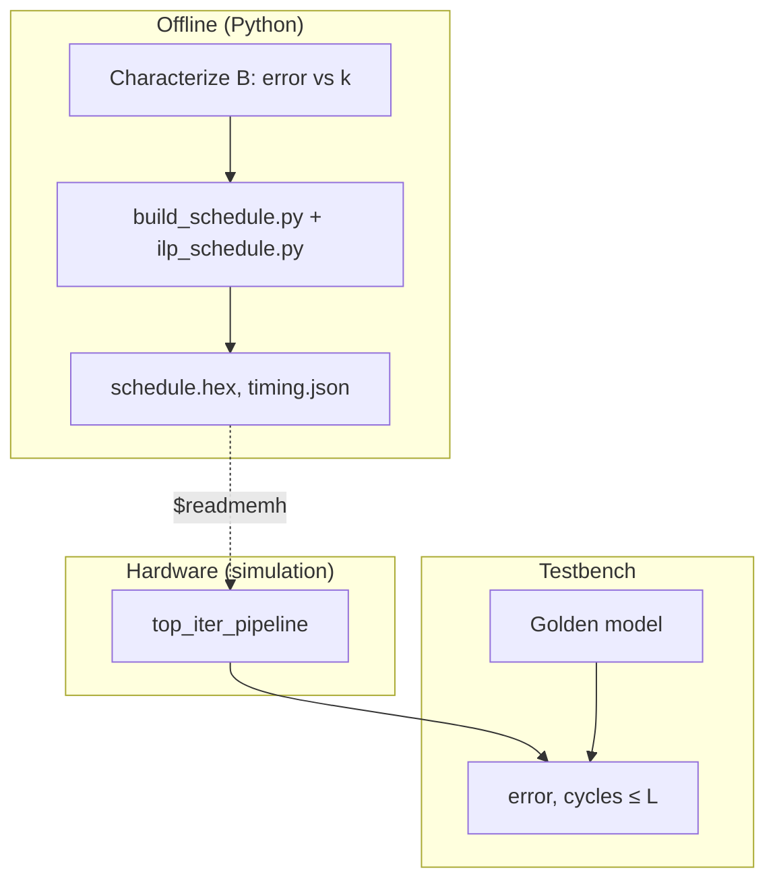
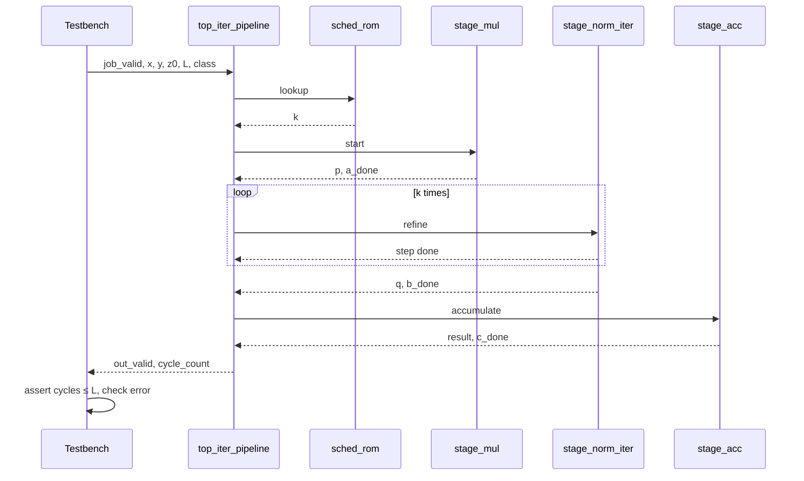
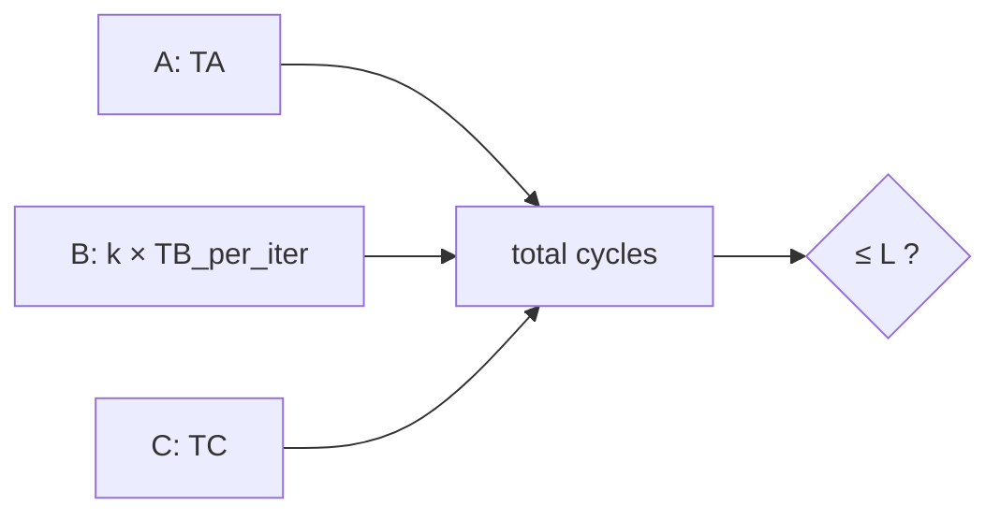
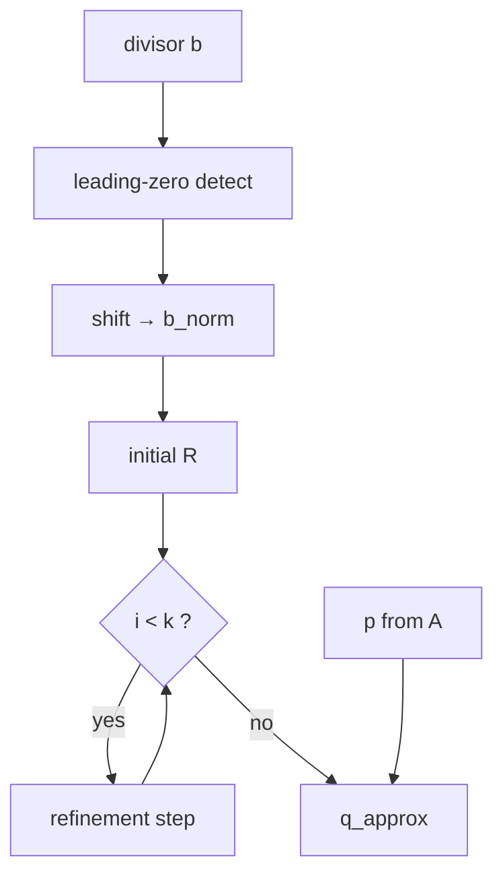
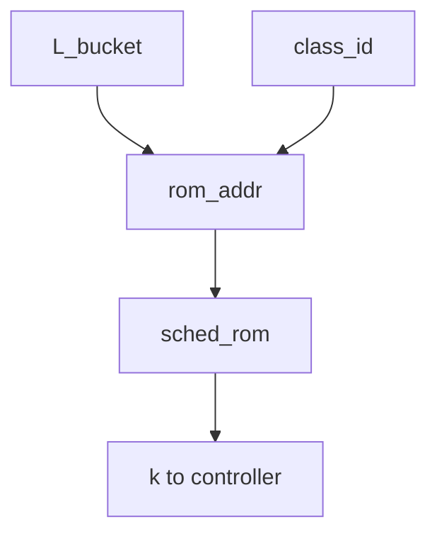
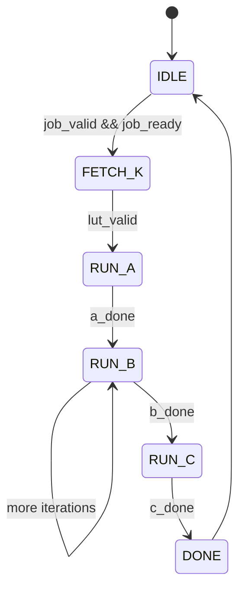
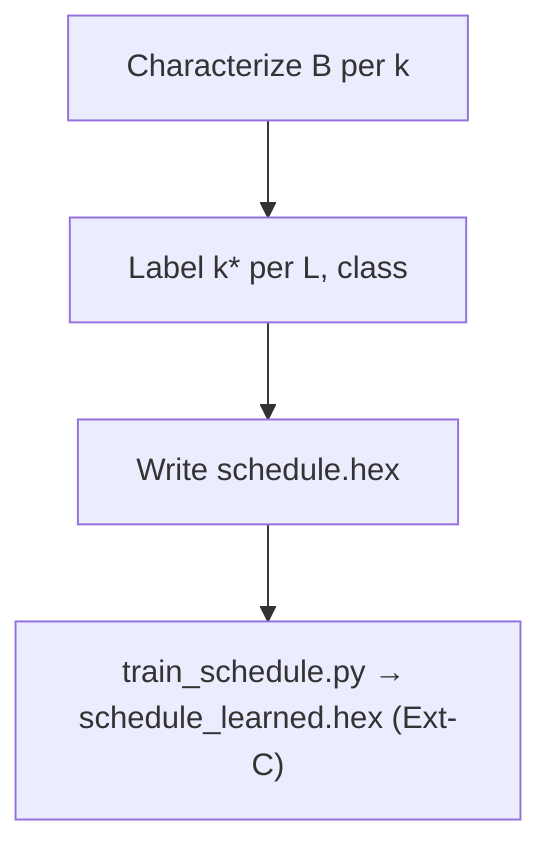

# Latency-bounded iterative approximate pipeline — step-by-step walkthrough

**Purpose:** A single document you can read top-to-bottom to understand **what** this project is, **what every term means**, **how the pieces connect**, and **how to implement each block** (broken into smaller sub-blocks). Diagrams are included here; additional figures live in [`iterative_approximate_dag_diagram.md`](iterative_approximate_dag_diagram.md).

**Repository:** `Latency-Bounded-Scheduling-For-Iterative-Approximate-Pipeline`

---

## Part 0 — The problem in one minute

Many embedded pipelines must finish a chain of operations before a **deadline** (a maximum number of clock cycles). One stage in the chain is **iterative**: it improves its answer by repeating a refinement step. More repetitions → **better accuracy** but **more cycles**.

**This project answers:**

> For each incoming job, how many refinement iterations **`k`** should we run so we **never exceed** cycle budget **`L`**, while keeping the **final numeric error** as small as possible?

**Approach (full scope — extensions Ext-A … Ext-D):**

1. Build the pipeline in **RTL** and **measure** `TA`, `TB_per_iter`, `TC` (**Ext-A**).
2. **Precompute** optimal **`k*`** (exhaustive + **ILP oracle** on the A→B→C graph) → ROM **`schedule.hex`** (**Ext-A**).
3. Add **early-stop** in Station B: **`k_max`** cap + residual **ε** (**Ext-B**).
4. **Train/export** a compressed learned schedule; ablate vs gold ROM (**Ext-C**).
5. **Assert** `cycle_count ≤ L` at job done via SVA (**Ext-D**).
6. **Measure** vs baselines (always min-`k`, always max-`k`, fixed-`k` ROM, early-stop, learned).

Extension spec and exit criteria: [`02_RESEARCH_EXTENSIONS_ABCD.md`](02_RESEARCH_EXTENSIONS_ABCD.md).

---

## Part 1 — Vocabulary (read before anything else)

| Term | Meaning in this project |
|------|-------------------------|
| **Job** | One end-to-end run: operands go in, one result comes out. |
| **Cycle** | One rising edge of the clock; the unit of time in simulation. |
| **Deadline `L`** | Maximum cycles allowed for this job (entire A→B→C path). |
| **`k` / `k_max`** | **Maximum** refinement iterations in Station B (e.g. 2, 4, or 6). With **Ext-B**, actual iterations **`i_done ≤ k_max`**. |
| **`ε` (epsilon)** | Early-stop threshold on residual in Station B (**Ext-B**). |
| **`i_done`** | Iterations actually executed in B (≤ **`k_max`**). |
| **`TA`, `TC`** | Fixed cycle costs of Station A and Station C (constants you measure from RTL). |
| **`TB_per_iter`** | Cycles consumed by **one** refinement step in Station B. |
| **Cycle budget** | `TA + k × TB_per_iter + TC` must be **≤ `L`**. |
| **RTL** | SystemVerilog/Verilog source that describes digital logic. |
| **Fixed-point** | Integers with an agreed binary point (e.g. Q1.15); no floating-point unit required. |
| **Golden model** | High-precision reference (Python/C) used to score hardware output. |
| **Scheduler / ROM** | Hardware that outputs **`k_max`** (and optional **ε**) from **`L`** bucket and **class**. |
| **DAG** | Directed acyclic graph of dependencies; here simply **A → B → C** (a chain). |
| **CSR** | Control/status register; testbench or host sets **`L`**, reads **status**. |
| **Station A / B / C** | The three processing blocks in order. |
| **Learned schedule (Ext-C)** | Compressed policy predicting **`k*`**; validated against gold ROM from Ext-A. |
| **Ext-A … Ext-D** | Research extensions: oracle RTL, early-stop, learned ROM, formal deadline (**see doc 02**). |

---

## Part 2 — Big picture (offline + hardware + test)

### 2.1 What happens before silicon or simulation config

Software studies the math and builds a **schedule table**: for each combination of (deadline bucket, input class), store the best **`k`**.

### 2.2 What happens in hardware each job

Hardware looks up **`k`**, runs A then B ( **`k`** times inner loop) then C, counts cycles, outputs result.

### 2.3 What the testbench checks

Compare result to golden model; assert **cycles ≤ L**; log CSV for plots.

### 2.4 System diagram



*Full diagram set: [`iterative_approximate_dag_diagram.md`](iterative_approximate_dag_diagram.md) §1–12.*

---

## Part 3 — The three stations (plain language)

Think of a **factory line** with three machines in a row:

| Station | Name | Fast or careful? | Output |
|---------|------|------------------|--------|
| **A** | Multiply | Always **fixed** work | `p = x × y` |
| **B** | Normalize / divide | **Dial `k`**: more iterations = more accurate | `q` ≈ normalized `p` |
| **C** | Accumulate | Always **fixed** work | `result = z0 + q` (or similar) |

**Order is strict:** B cannot start until A finishes; C cannot start until B finishes.

**The only quality knob in v1 is `k`** on Station B.

---

## Part 4 — One job, step by step (runtime narrative)

| Step | What happens |
|------|----------------|
| **1** | Testbench asserts `job_valid`; presents `x`, `y`, `z0`, `csr_deadline_L`, optional `segment_class_id`. |
| **2** | Controller maps `L` → `L_bucket`; scheduler ROM returns **`k`**. |
| **3** | Controller clears **job cycle counter**; enters **RUN_A**. |
| **4** | Station A computes **`p`**; signals **a_done** after `TA` cycles. |
| **5** | Station B runs up to **`k_max`** refinements (**Ext-B:** may stop early); signals **b_done**. |
| **6** | Station C computes **result**; signals **c_done** after `TC` cycles. |
| **7** | Controller asserts **out_valid**; exposes **cycle_count**. |
| **8** | Testbench checks **cycle_count ≤ L** and **|result − y_ref|**. |

### 4.1 Sequence diagram



---

## Part 5 — Cycle budget (the core constraint)

**Formula:**

```text
cycles_worst = TA + k_max × TB_per_iter + TC
cycles_worst ≤ L
```

**Ext-B:** `cycles_actual = TA + i_done × TB_per_iter + TC` with `i_done ≤ k_max`. Offline scheduling uses **worst-case** so deadlines are never exceeded.

**Example** (replace with your measured constants):

| Parameter | Value |
|-----------|------:|
| TA | 3 |
| TB_per_iter | 3 |
| TC | 3 |
| L | 20 |
| k max feasible | floor((20−3−3)/3) = **4** |

If ROM chooses **`k = 6`** but only 4 fit in **`L`**, that row is **invalid** — offline tool must only emit feasible pairs.



---

## Part 6 — Implementation map (every block → sub-blocks)

Below is the **recommended build order**. Each top-level block lists **sub-blocks**, **interfaces**, and **done criteria**.

---

### 6.1 Block: `stage_mul` (Station A)

**Role:** `p = x * y` in fixed-point.

| Sub-block | What to implement | Done when |
|-----------|-------------------|-----------|
| **A.1** | Parameter `W` (width), define Q format (e.g. Q1.15) | Format documented in README |
| **A.2** | Combinational or pipelined multiplier | Matches golden on 1k random pairs |
| **A.3** | `start` / `done` handshake | FSM can wait on **a_done** |
| **A.4** | Overflow / saturation policy | Documented; tests for max inputs |

**Inputs:** `clk`, `rst_n`, `x[W-1:0]`, `y[W-1:0]`, `start`  
**Outputs:** `p[W-1:0]`, `done`  
**Latency:** **`TA`** cycles (measure with `$time` or cycle counter in TB)

---

### 6.2 Block: `stage_norm_iter` (Station B) — **critical path**

**Role:** Iterative divide/normalize. **v1 core:** exactly **`k`** steps. **Ext-B:** at most **`k_max`** steps; stop early when **`|residual| < ε`**.

#### 6.2.1 Sub-blocks inside Station B

| Sub-block | What to implement | Done when |
|-----------|-------------------|-----------|
| **B.1 Normalize divisor** | Leading-zero detect + shift → `b_norm` in [0.5, 1) | Matches Python on test vectors |
| **B.2 Initial guess** | Seed `R` (linear approx or table) | Monotonic improvement vs k in sim |
| **B.3 Refinement step** | One NR or Taylor update: `R ← f(R, b_norm)` | One step matches golden step |
| **B.4 Iteration counter** | `i` from 0 to `k_max−1`; early exit if residual &lt; ε (**Ext-B**) | `i_done ≤ k_max`; `early_stop` status |
| **B.7 Early-stop compare** | Fixed-point residual vs `epsilon` | Matches golden early-stop path |
| **B.5 Finalize** | `q ≈ p_norm × R` (+ exponent adjust if used) | End-to-end error vs k plot |
| **B.6 Handshake** | `start`, `k`, `done` | Top FSM integrates |

#### 6.2.2 Station B internal diagram



**Inputs:** `p`, divisor or implicit scale, `k`, `start`  
**Outputs:** `q`, `done`  
**Latency:** **`k × TB_per_iter + overhead`**

**Implementation note:** Build **B.3** and **B.4** first in isolation with **`k`** wired from TB; only then connect to A and C.

---

### 6.3 Block: `stage_acc` (Station C)

**Role:** Combine `q` with `z0` (e.g. `result = z0 + q`).

| Sub-block | What to implement | Done when |
|-----------|-------------------|-----------|
| **C.1** | Wide enough accumulator (avoid wrap in test range) | Golden match |
| **C.2** | Saturation on output | Documented |
| **C.3** | `start` / `done` | **`TC`** cycles measured |

---

### 6.4 Block: `sched_rom` + `sched_addr_gen` (Scheduler)

**Role:** Output **`k`** given **`L_bucket`** and **`segment_class_id`**.

| Sub-block | What to implement | Done when |
|-----------|-------------------|-----------|
| **S.1** | Map `csr_deadline_L` → `L_bucket_id` (comparators or CSR write) | Same L always same bucket in v1 |
| **S.2** | `rom_addr = f(L_bucket, class)` | Address matches Python builder |
| **S.3** | ROM loaded via `$readmemh("schedule.hex")` | k matches Python for all rows |
| **S.4** | Optional: status if row missing | ERR state in top FSM |



---

### 6.5 Block: `pipeline_ctrl` (Top controller FSM)

**Role:** Orchestrate A → B → C; count job cycles; drive handshake.

| Sub-block | What to implement | Done when |
|-----------|-------------------|-----------|
| **F.1** | States: IDLE, FETCH_K, RUN_A, RUN_B, RUN_C, DONE, ERR | Waveform matches spec |
| **F.2** | `cycle_job` counter | TB reads **`cycle_count_seen`** |
| **F.3** | `busy`, `job_ready`, `out_valid` | TB can pump jobs |
| **F.4** | Load **`k`** in FETCH_K; hold through RUN_B | B receives stable **`k`** |



---

### 6.6 Block: `top_iter_pipeline` (Integration)

| Sub-block | What to implement | Done when |
|-----------|-------------------|-----------|
| **T.1** | Wire all ports per diagram doc §2 | Compiles |
| **T.2** | Parameterize `W`, `KMAX`, `TA`, `TB`, `TC` | Single Makefile target |
| **T.3** | End-to-end directed test (one job) | Pass |
| **T.4** | Random job regression (N jobs) | Pass |

---

### 6.7 Block: Testbench + software (not RTL, required for credibility)

| Sub-block | File (planned) | Done when |
|-----------|----------------|-----------|
| **TB.1** | Driver: jobs with sweep over **L** | CSV: L, k, cycles, error |
| **TB.2** | Golden model (Python or DPI) | Reference for all tests |
| **TB.3** | Scoreboard: assert cycles ≤ L | 0 failures on scheduled runs |
| **SW.1** | `build_schedule.py` — exhaustive **k*** labels | `schedule.hex` regenerates |
| **SW.2** | `ilp_schedule.py` — ILP oracle (**Ext-A**) | Agreement report vs exhaustive |
| **SW.3** | `train_schedule.py` — learned ROM (**Ext-C**) | `schedule_learned.hex` |
| **SW.4** | `plot_results.py` — all flagship figures | PNG in `results/` |
| **TB.4** | `deadline_props.sv` or bind — SVA (**Ext-D**) | Pass on scheduled; fail demo on max-k |

---

## Part 7 — Offline software path (step by step)

| Step | Action | Output |
|------|--------|--------|
| **7.1** | Define `K_set = {2, 4, 6}` and fixed-point format | `config.json` |
| **7.2** | For grid of operands, simulate B alone → error **`e_B(k)`** | `char_b.csv` |
| **7.3** | For each sample job + each feasible **k**, compute end-to-end error | `jobs.csv` |
| **7.4** | For each `(L_bucket, class)`, set **k*** = argmin error s.t. budget ≤ L | `schedule table` |
| **7.5** | Emit **`schedule.hex`** for `$readmemh` | `data/schedule.hex` |
| **7.6** | `ilp_schedule.py` — compare to exhaustive (**Ext-A**) | Agreement % in `results/` |
| **7.7** | `train_schedule.py` → **`schedule_learned.hex`** (**Ext-C**) | Ablation vs gold |



Detail: [`learned_schedule_policy_and_roadmap.md`](learned_schedule_policy_and_roadmap.md) §4.

---

## Part 8 — Extensions Ext-A … Ext-D (summary)

Full spec: [`02_RESEARCH_EXTENSIONS_ABCD.md`](02_RESEARCH_EXTENSIONS_ABCD.md).

### Ext-A — RTL + ILP/exhaustive oracle

- Measure **`TA`, `TB_per_iter`, `TC`** from simulation; store in `data/timing.json`.
- `build_schedule.py` + `ilp_schedule.py` on the same A→B→C graph → **`schedule.hex`**.
- Testbench: **0%** deadline misses on ROM-scheduled jobs; ROM **`k`** matches oracle.

### Ext-B — Early-stop under `k_max`

- ROM outputs **`k_max`**; B stops when residual **&lt; ε** (CSR or ROM bucket).
- Worst-case cycles still **`TA + k_max·TB + TC ≤ L`**.
- Plot **cycles saved** and **error** vs fixed-**k** at same **`L`**.

### Ext-C — Learned / compressed schedule

- Train on features (`L_bucket`, `class_id`, …); export **`schedule_learned.hex`**.
- Report **k match rate**, **mean error gap**, **ROM bytes** vs gold table.
- Datapath unchanged; only ROM contents differ from gold.

### Ext-D — Formal deadline property

- SVA: **`out_valid |-> cycle_count_seen <= csr_deadline_L`** for scheduled policies.
- Negative test: always-max-**k** may violate **`L`** (assert should fail).

**Do not** replace iterative divide with a neural network — that removes the Station B story.

---

## Part 9 — What success looks like (metrics)

### 9.1 Figures

| # | Plot | Extension |
|---|------|-----------|
| 1 | **Error vs `L`** — gold ROM, learned, early-stop, min-k, max-k | A, B, C |
| 2 | **Cycles vs `L`** — early-stop vs fixed-k | B |
| 3 | **ROM size / k match %** — learned vs gold | C |
| 4 | **ILP vs exhaustive agreement** | A |

### 9.2 Required table (example columns)

| Policy | Deadline miss rate | Mean error | Mean cycles | Notes |
|--------|-------------------|------------|-------------|-------|
| Gold ROM (fixed k) | 0% | (fill) | (fill) | Ext-A |
| Gold ROM + early-stop | 0% | (fill) | ≤ fixed-k | Ext-B |
| Learned ROM | 0% | (fill) | (fill) | Ext-C vs gold |
| Always min-k | 0% | higher | low | Baseline |
| Always max-k | (fill) | lowest | high | May violate L |

---

## Part 10 — Phased implementation schedule (summer)

Aligned with [`02_RESEARCH_EXTENSIONS_ABCD.md`](02_RESEARCH_EXTENSIONS_ABCD.md) and [`learned_schedule_policy_and_roadmap.md`](learned_schedule_policy_and_roadmap.md).

| Phase | Weeks (est.) | Extension | Exit criterion |
|-------|--------------|-----------|----------------|
| **1** — Station B (fixed **k**) | 1–1.5 | — | error vs **k** plot |
| **2** — A, C units | 0.5–1 | — | golden tests pass |
| **3** — Top + FSM + cycle counter | 1 | Ext-A start | one E2E job passes |
| **4** — ROM + `build_schedule.py` + `ilp_schedule.py` | 1 | **Ext-A** | 0% misses; ILP agrees with exhaustive |
| **5** — Sweeps + `RESULTS.md` | 0.5 | Ext-A | error vs **L** flagship plot |
| **6** — Early-stop in B | 1–1.5 | **Ext-B** | cycles vs error plot |
| **7** — `train_schedule.py` + ablation | 1–2 | **Ext-C** | learned metrics vs gold |
| **8** — SVA + CI | 0.5–1 | **Ext-D** | `make test` + assert pass on scheduled |
| **9** — Optional FPGA demo | 1+ | — | UART log only if time |

---

## Part 11 — Repository layout (target)

```text
docs/
  00_START_HERE_READ_THESE_FOUR_DOCS.md
  01_PROJECT_WALKTHROUGH_STEP_BY_STEP.md
  02_RESEARCH_EXTENSIONS_ABCD.md          ← Ext-A…D spec
  iterative_approximate_dag_storyboard.md
  iterative_approximate_dag_diagram.md
  learned_schedule_policy_and_roadmap.md
  RESULTS.md                              ← after measurements
rtl/
  stage_mul.sv, stage_norm_iter.sv, stage_acc.sv
  sched_rom.sv, sched_addr_gen.sv, pipeline_ctrl.sv
  top_iter_pipeline.sv, csr_regs.sv
  assertions/deadline_props.sv            ← Ext-D
tb/
  tb_top.sv, scoreboard.sv
sw/
  golden_model.py, characterize_b.py
  build_schedule.py, ilp_schedule.py      ← Ext-A
  train_schedule.py, plot_results.py      ← Ext-C
data/
  schedule.hex, schedule_learned.hex, timing.json
results/
Makefile                                  ← sim, test, schedule, ilp, train, plot
```

---

## Part 12 — Bus-level ASCII (single-page reference)

```
  OFFLINE:  characterize → optimize k per (L_bucket, class) → schedule.hex
                              │
                              ▼ $readmemh
  RTL:  [CSR L, class] → scheduler ROM → k
              → FSM → MUL → NORM (k iter) → ACC → result, cycle_count
                              │
  TB:   stimulus ─────────────┘──→ compare golden, assert cycles ≤ L
```

Full ASCII: [`iterative_approximate_dag_diagram.md`](iterative_approximate_dag_diagram.md) §12.

---

## Part 13 — Related documents

| Need | Read |
|------|------|
| **Ext-A…D scope + checklists** | [`02_RESEARCH_EXTENSIONS_ABCD.md`](02_RESEARCH_EXTENSIONS_ABCD.md) |
| 5-minute story | [`iterative_approximate_dag_storyboard.md`](iterative_approximate_dag_storyboard.md) |
| Diagrams + signals | [`iterative_approximate_dag_diagram.md`](iterative_approximate_dag_diagram.md) |
| Ext-C + build phases | [`learned_schedule_policy_and_roadmap.md`](learned_schedule_policy_and_roadmap.md) |
| Index | [`00_START_HERE_READ_THESE_FOUR_DOCS.md`](00_START_HERE_READ_THESE_FOUR_DOCS.md) |

---

*End of walkthrough — latency-bounded iterative approximate pipeline.*
