# Project diagrams: latency-bounded iterative approximate pipeline (detailed)

Use a Markdown viewer with **Mermaid**, or [mermaid.live](https://mermaid.live). **ASCII** sections work in any terminal.

**Notation:** `W` = fixed-point width (e.g. 16 or 24). `k` = iteration count for Station B. `L` = max cycles per end-to-end **job**.

---

## 1. System context (everything on one canvas)

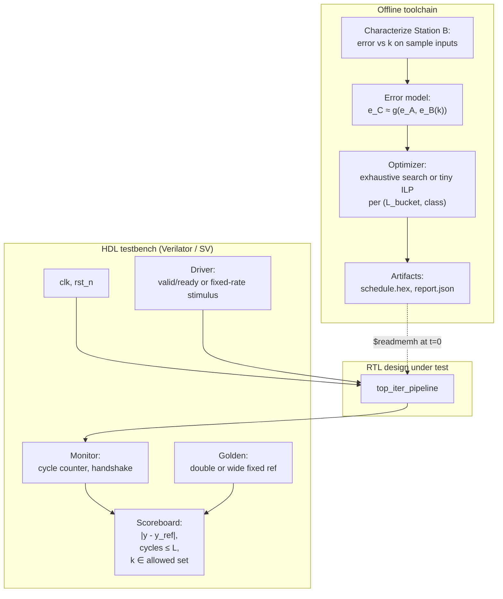

---

## 2. Top-level RTL blocks and **main signals**

Logical grouping only; your RTL may merge registers differently.

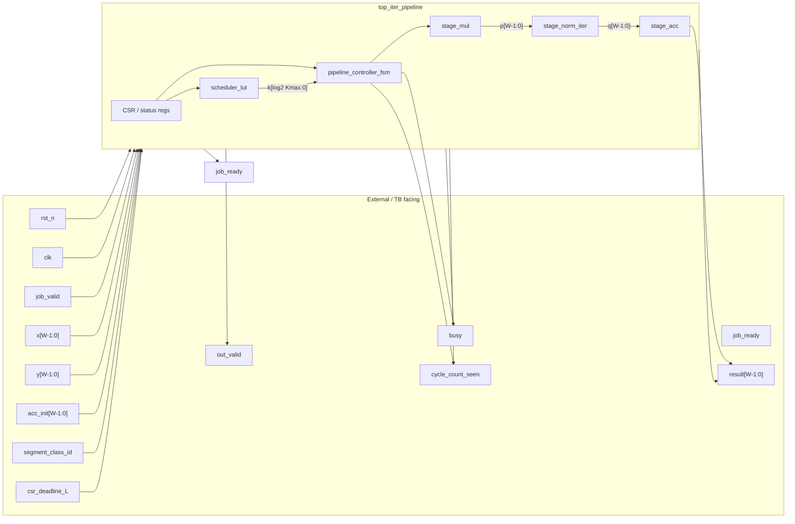

**Suggested semantics**

| Signal | Role |
|--------|------|
| `job_valid` / `job_ready` | One **job** accepted when both high (or use fixed start every N cycles). |
| `x`, `y` | Operands into **Station A** (e.g. multiply inputs). |
| `z0` | Initial accumulator for **Station C** (often 0). |
| `segment_class_id` | Selects **row** in schedule table (e.g. “quiet” vs “busy” input regime). |
| `csr_deadline_L` | Max **total** cycles for A+B+C for this job (or use discrete **bucket** index). |
| `k` | Latency–quality dial for **B** only; comes from LUT output. |
| `cycle_count_seen` | Exposed for TB to assert **≤ L**. |

---

## 3. Scheduler: how the **ROM row** is chosen

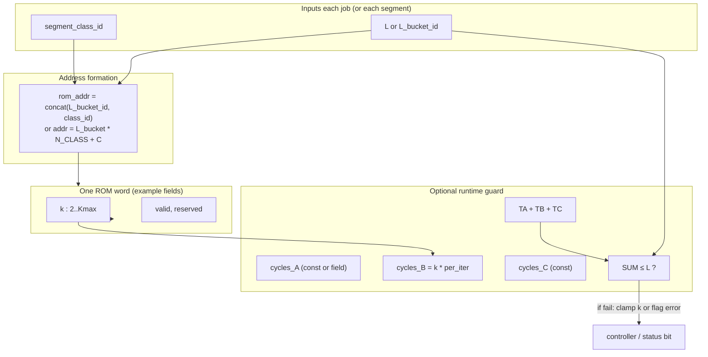

**V1 simplification:** Precompute rows only for **feasible** `(L_bucket, class)` so **SUM ≤ L** always holds; ROM then only stores **k**.

---

## 4. Datapath with **pipeline registers** (optional but realistic)

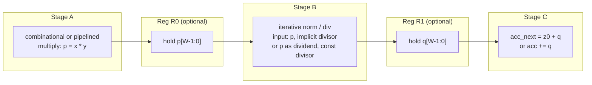

**Semantic choice (pick one and stick to it):**  
- **A** outputs **product** `p`; **B** treats `p` as **dividend** and uses **fixed divisor** from CSR for **normalize**, **or**  
- **A** outputs `p = x*y`; **B** computes `q ≈ p / scale` with **iterative reciprocal** of `scale`.

---

## 5. Station B **internal** (iterative refinement datapath)

Example: **multiplicative** normalize using **reciprocal** of normalized divisor `b` (Behroozi / SAADI-flavored).

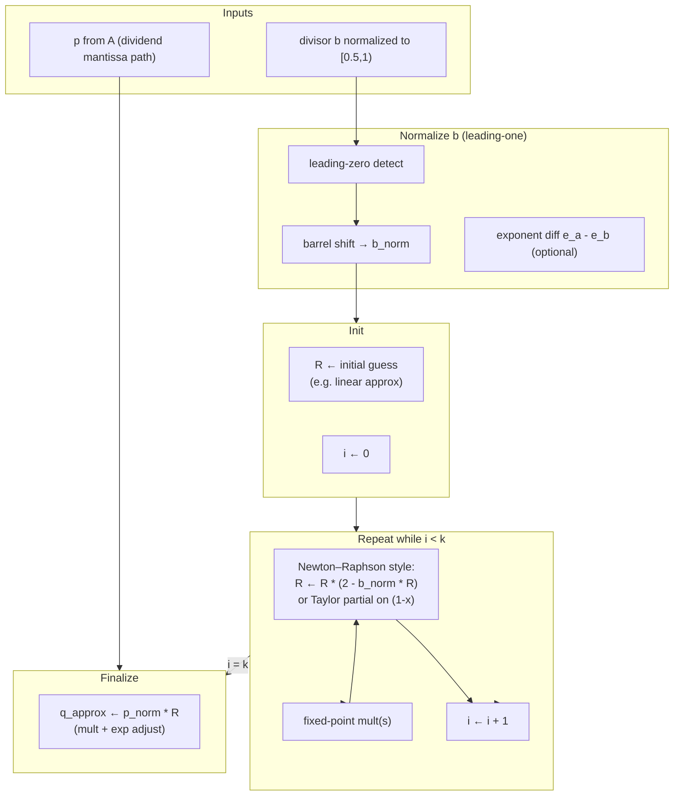

**RTL detail:** Each **NR** step might be **2–3 cycle pipelined mult**; total **B latency** ≈ `k * (cycles per iteration) + overhead`.

---

## 6. **Top-level controller** FSM (conceptual states)

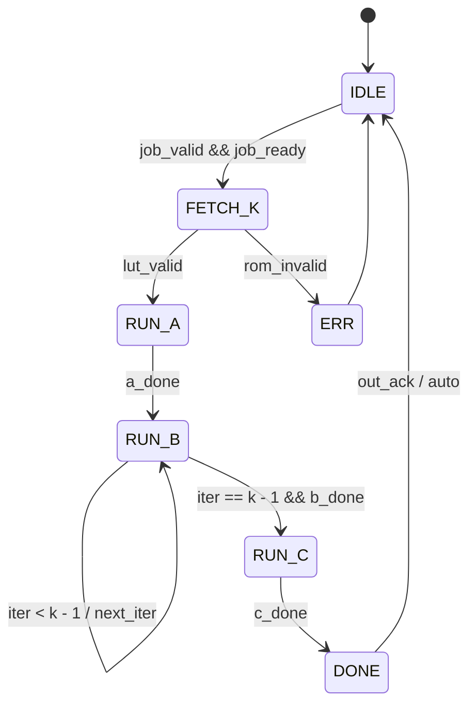

**Counters to expose to TB:** `cycle_job` cleared on job start; increment every clk; compare to `L` at **DONE**.

---

## 7. **Sequence** diagram: one job, TB vs DUT

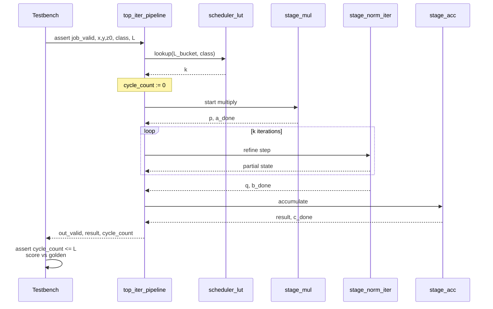

---

## 8. **Offline** flow (what Python does before sim)

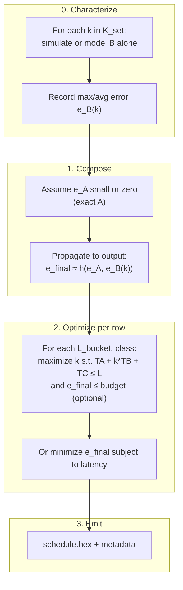

This mirrors the **paper-style** story: **input-dependent** error is simplified to **per-mode** statistics in student scope.

---

## 9. **Timing budget** (cycles per job)

Replace numbers with your real `TA`, `TB_per_iter`, `TC`, `Kmax`.

**One-line formula:** `cycles_total = TA + k * TB_per_iter + TC` → must satisfy `cycles_total ≤ L`.

**Example bar (conceptual):**

| Segment | Cycles (example) | Notes |
|--------|-------------------|--------|
| A | `TA = 3` | Fixed |
| B | `k × TB_per_iter` e.g. `4 × 3 = 12` | Scales with **k** |
| C | `TC = 3` | Fixed |
| **Sum** | `18` | |
| **Slack** | `L - sum` e.g. `20 - 18 = 2` | Room for FSM overhead if you budget it |

If `L=20`, `TA=3`, `TB_per_iter=3`, `TC=3`: then `k_max = floor((L - TA - TC) / TB_per_iter) = floor(14/3) = 4`. Scheduler picks `k ≤ k_max` for that **L** row.

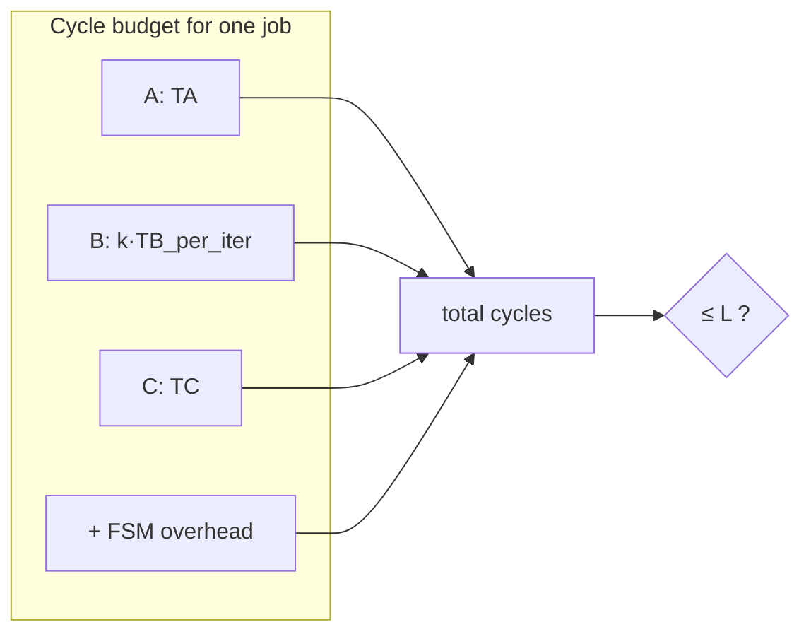

---

## 10. **Testbench** architecture (detailed)

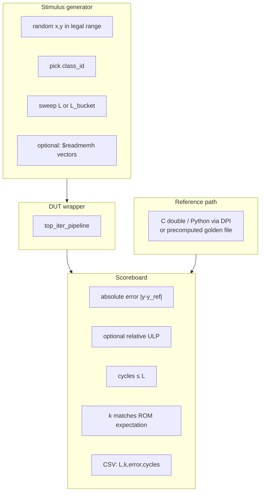

---

## 11. Error propagation (toy model you might implement offline)

```mermaid
flowchart LR
  eA["e_A<br/>(A output error)"]
  eB["e_B(k)<br/>(B local)"]
  eC["e_C<br/>(C: often exact)"]

  eA --> COMB["combine:<br/>e.g. quadrature sum<br/>or affine model"]
  eB --> COMB
  COMB --> eF["e_final"]
  eC --> eF
```

**V1:** Treat **A,C exact**; only **e_B(k)** matters for ranking **k**.

---

## 12. ASCII — detailed bus-level picture

```
                         OFFLINE
  +----------+    +-----------+    +----------------------+    +-------------+
  | Sample   |    | Fit e_B(k)|    | For each (L_bkt,cls): |    | schedule.   |
  | inputs   |--->| per stage |--->| choose k (and maybe   |--->| hex + meta  |
  +----------+    +-----------+    | verify TA+k*TB+TC≤L)  |    +------+------+
                                   +----------------------+           |
                                                                        | $readmemh
                         RTL ON CHIP / SIM                             v
  +----------------------------------------------------------------------------------+
  |  csr_deadline_L  segment_class_id   x[W] y[W] z0[W]   job_valid                  |
  |       |                |               |    |    |         |                     |
  |       v                v               v    v    v         v                     |
  |  +---------+     +-----------+    +----------------------------------+           |
  |  | map L to |     | ROM addr  |    | pipeline_controller_fsm         |           |
  |  | L_bucket |---->| decode    |--->| idle/fetch_k/run_a/run_b/run_c  |           |
  |  +---------+     +-----+-----+    +----+-----------+----+----------+             |
  |                        |               |           |    |                        |
  |                        v               | start     |    | done                   |
  |                  +-----v-----+          |           |    |                       |
  |                  | sched_rom |          |           |    |                       |
  |                  | row: k    |----------+           |    |                       |
  |                  +-----------+                      |    |                       |
  |                                                     v    v                       |
  |                                            +--------+----+--------+              |
  |                                            | stage_mul     | TA cycles           |
  |                                            | p = x * y     |                     |
  |                                            +-------+-------+                     |
  |                                                    | p[W]                        |
  |                                                    v                             |
  |                                            +-------+-------+                     |
  |                                            | stage_norm    | k * TB cycles       |
  |                                            | iterative R   |                     |
  |                                            +-------+-------+                     |
  |                                                    | q[W]                        |
  |                                                    v                             |
  |                                            +-------+-------+                     |
  |                                            | stage_acc     | TC cycles           |
  |                                            | out = z0+q    |                     |
  |                                            +-------+-------+                     |
  |                                                    |                             |
  |  job_ready  out_valid  result[W]  cycle_count  status (err,overflow) <---------+
  +----------------------------------------------------------------------------------+
                                        |
  TESTBENCH                             v
  +----------------+    +-----------------------+    +------------------+
  | drive jobs     |    | golden y_ref          |    | CSV / assertions |
  | sweep L, class |--->| (C model or file)     |--->| cycles<=L, error |
  +----------------+    +-----------------------+    +------------------+
```

---

## 13. File / module checklist (implementation map)

| Block | Suggested RTL module | Notes |
|-------|----------------------|--------|
| Schedule storage | `sched_rom.sv` | `$readmemh`; width = `k` + optional flags. |
| Address | `sched_addr_gen.sv` | Concatenate **L_bucket** and **class_id**. |
| FSM | `pipeline_ctrl.sv` | Drives `start_a`, `en_b_iter`, `start_c`, `busy`. |
| Multiply | `stage_mul.sv` | Fixed-point; document **Q format**. |
| Iter norm | `stage_norm_iter.sv` | **k**-bounded loop; internal mult pipeline. |
| Accum | `stage_acc.sv` | Wide enough to avoid overflow for test range. |
| CSR | `csr_regs.sv` | **L**, **class**, **status** (done, err). |
| Top | `top_iter_pipeline.sv` | Tie + parameters `W`, `KMAX`. |

---

## File reference

- Storyboard: `iterative_approximate_dag_storyboard.md`  
- Earlier short diagrams: merged and superseded by this file for detail.
